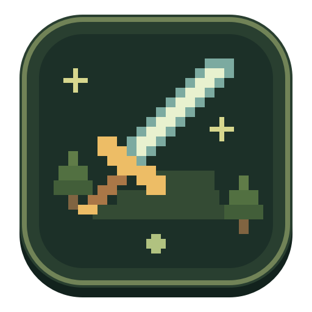

# Sidequest

A local-first pixel-art productivity RPG. Turn work into short adventures, earn loot, grow a squad of companions, and build a cozy treehouse. Rest is part of the game.



Sidequest is a working prototype for **Apple Silicon Macs running macOS 14 or newer**. It uses a small AppKit/WKWebView shell and a bundled Node.js server. There are **no npm dependencies**, and it works with built-in stories before you connect a local model.

## Run from source

Install Node.js 22 or newer (Node 24 is recommended), then:

```sh
git clone https://github.com/wpvip-awesomeface/sidequest.git
cd sidequest
npm test
npm start
```

Open <http://127.0.0.1:47831>. No `npm install` is needed. The browser version supports the game and local models; Mac Calendar access requires the desktop app. Keychain-backed connections require building the Mac app once, including its credential helper.

To keep development separate from your real game:

```sh
SIDEQUEST_DATA_DIR="$PWD/.sidequest-dev" PORT=47832 npm start
```

## Build the Mac app

On an Apple Silicon Mac, install Xcode Command Line Tools (`xcode-select --install`) and an **arm64 Node.js** installation, then run:

```sh
npm run build:mac
open dist/Sidequest.app
```

To create the shareable disk image:

```sh
npm run package:mac
```

Output: `dist/Sidequest-Apple-Silicon.dmg` and its `.sha256` checksum. Recipients need neither Node.js nor developer tools. The app bundles the build machine’s Node runtime and redistribution notices, but no personal saves, model files, or credentials.

**This prototype is ad-hoc signed, not Apple-notarized.** See [Mac build and distribution](docs/BUILD-MAC.md) for prerequisites, troubleshooting, and release limitations.

## What’s inside

- Personal quests, priorities, focus battles, daily rivals, XP, rare loot, and spells.
- Short branching chapters, a growing map, recurring foes, and friendships.
- Custom adventurers, pets, optional supportive check-ins, and a gold-funded treehouse.
- Optional stories from local Ollama, LM Studio, or an OpenAI-compatible server.
- Assigned Linear issues, with links back to the original issue.
- Direct Google Calendar or Mac calendars; today’s timed meetings automatically become quests.

Completing a quest never changes its Linear issue or calendar event. Imports do not award XP; completing quests does.

## Connections and privacy

All integrations are optional. [Connection setup](docs/CONNECTIONS.md) covers local models, Linear, and Google Calendar’s one-time OAuth setup. Google sign-in requires your own Desktop app OAuth client; a working Google client is not bundled in this source repository.

Saves live at `~/Library/Application Support/Sidequest/save.json`. Linear keys and Google tokens use macOS Keychain. Back up saves with the app closed. Imported work titles and descriptions are private data: never commit your save or credentials. The server listens only on loopback; there is no hosted Sidequest account, database, or telemetry.

## Development

- [User guide and game mechanics](docs/USER-GUIDE.md)
- [Mac build and distribution](docs/BUILD-MAC.md)
- [Connection setup](docs/CONNECTIONS.md)
- [Contributing and architecture](CONTRIBUTING.md)
- [Security and data handling](SECURITY.md)

Run `npm test` before sharing changes. Tests use isolated saves and mocked external services. Live Google/Linear account access is not exercised by CI.

## License

No open-source license has been selected yet. Repository visibility alone does not grant a general license to redistribute or reuse the code. Node.js bundled in locally built apps retains its own included license notices.
